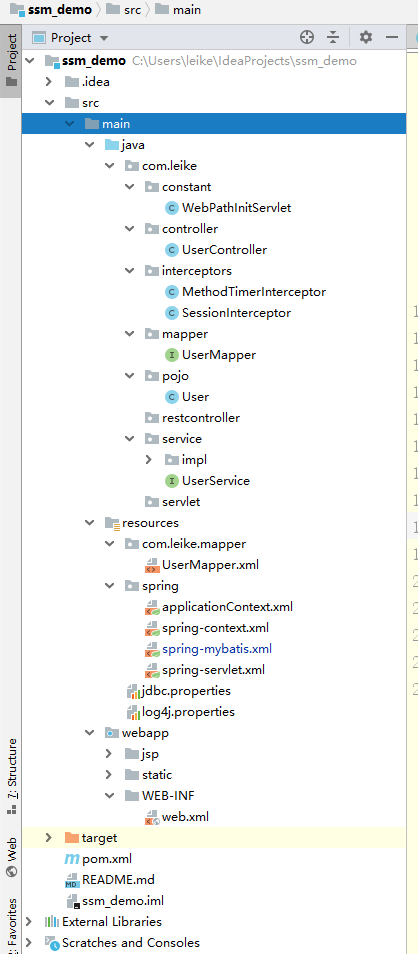

# ssm_demo
spring springMVC mybatis整合demo
# SSM整合

spring和springMVC是天然集成,所以只需要解决mybatis和spring整合的问题 , 中间项目mybatis-spring项目进行整合 

- 由spring容器管理mybatis和mapper.
- 由spring利用声明式事物(==AOP==)进行事物综合管理.
## ssm整合目录


## pom.xml

```xml
<?xml version="1.0" encoding="UTF-8"?>

<project xmlns="http://maven.apache.org/POM/4.0.0" xmlns:xsi="http://www.w3.org/2001/XMLSchema-instance"
         xsi:schemaLocation="http://maven.apache.org/POM/4.0.0 http://maven.apache.org/xsd/maven-4.0.0.xsd">
    <modelVersion>4.0.0</modelVersion>

    <groupId>com.leike</groupId>
    <artifactId>ssm_demo</artifactId>
    <version>1.0-SNAPSHOT</version>
    <packaging>war</packaging>

    <name>ssm_demo Maven Webapp</name>
    <!-- FIXME change it to the project's website -->
    <url>http://www.example.com</url>

    <properties>
        <project.build.sourceEncoding>UTF-8</project.build.sourceEncoding>
        <maven.compiler.source>1.8</maven.compiler.source>
        <maven.compiler.target>1.8</maven.compiler.target>
        <!--版本指定-->
        <spring.version>5.1.8.RELEASE</spring.version>
        <jackson.version>2.9.9</jackson.version>
    </properties>

    <dependencies>
        <dependency>
            <groupId>junit</groupId>
            <artifactId>junit</artifactId>
            <version>4.12</version>
            <scope>test</scope>
        </dependency>
        <!--spring依赖 ==start==-->
        <dependency>
            <groupId>org.springframework</groupId>
            <artifactId>spring-core</artifactId>
            <version>${spring.version}</version>
        </dependency>
        <dependency>
            <groupId>org.springframework</groupId>
            <artifactId>spring-context</artifactId>
            <version>${spring.version}</version>
        </dependency>
        <dependency>
            <groupId>org.springframework</groupId>
            <artifactId>spring-context-support</artifactId>
            <version>${spring.version}</version>
        </dependency>
        <dependency>
            <groupId>org.springframework</groupId>
            <artifactId>spring-beans</artifactId>
            <version>${spring.version}</version>
        </dependency>
        <dependency>
            <groupId>org.springframework</groupId>
            <artifactId>spring-web</artifactId>
            <version>${spring.version}</version>
        </dependency>
        <dependency>
            <groupId>org.springframework</groupId>
            <artifactId>spring-webmvc</artifactId>
            <version>${spring.version}</version>
        </dependency>
        <dependency>
            <groupId>org.springframework</groupId>
            <artifactId>spring-aop</artifactId>
            <version>${spring.version}</version>
        </dependency>
        <dependency>
            <groupId>org.springframework</groupId>
            <artifactId>spring-aspects</artifactId>
            <version>${spring.version}</version>
        </dependency>
        <dependency>
            <groupId>org.springframework</groupId>
            <artifactId>spring-jdbc</artifactId>
            <version>${spring.version}</version>
        </dependency>
        <!--利用它来处理事务问题-->
        <dependency>
            <groupId>org.springframework</groupId>
            <artifactId>spring-tx</artifactId>
            <version>${spring.version}</version>
        </dependency>
        <!--spring依赖 ==end==-->

        <!--json依赖 ==start==-->
        <dependency>
            <groupId>com.fasterxml.jackson.core</groupId>
            <artifactId>jackson-databind</artifactId>
            <version>${jackson.version}</version>
        </dependency>
        <dependency>
            <groupId>com.fasterxml.jackson.core</groupId>
            <artifactId>jackson-core</artifactId>
            <version>${jackson.version}</version>
        </dependency>
        <dependency>
            <groupId>com.fasterxml.jackson.core</groupId>
            <artifactId>jackson-annotations</artifactId>
            <version>${jackson.version}</version>
        </dependency>
        <dependency>
            <groupId>net.sf.json-lib</groupId>
            <artifactId>json-lib</artifactId>
            <version>2.4</version>
            <classifier>jdk15</classifier>
        </dependency>
        <!--添加处理json为javabean-->
        <dependency>
            <groupId>org.codehaus.jackson</groupId>
            <artifactId>jackson-core-asl</artifactId>
            <version>1.9.13</version>
        </dependency>
        <dependency>
            <groupId>org.codehaus.jackson</groupId>
            <artifactId>jackson-mapper-asl</artifactId>
            <version>1.9.13</version>
        </dependency>
        <!--添加处理json为javabean ==end== -->

        <!--文件上传依赖 ==start==-->
        <dependency>
            <groupId>commons-fileupload</groupId>
            <artifactId>commons-fileupload</artifactId>
            <version>1.3.3</version>
        </dependency>
        <!--文件上传依赖 ==end==-->

        <!--mybatis依赖 ==start==-->
        <dependency>
            <groupId>org.mybatis</groupId>
            <artifactId>mybatis</artifactId>
            <version>3.4.6</version>
        </dependency>
        <!--mybatis分页依赖  ps:中国《mybatis从入门到精通》作者写的-->
        <dependency>
            <groupId>com.github.pagehelper</groupId>
            <artifactId>pagehelper</artifactId>
            <version>5.1.2</version>
        </dependency>
        <!--mybatis依赖 ==end==-->
        <!--mybatis与spring整合所需要的依赖-->
        <dependency>
            <groupId>org.mybatis</groupId>
            <artifactId>mybatis-spring</artifactId>
            <version>2.0.1</version>
        </dependency>
        <!--mysql依赖 ==start==-->
        <dependency>
            <groupId>mysql</groupId>
            <artifactId>mysql-connector-java</artifactId>
            <version>5.1.38</version>
        </dependency>
        <!--mysql依赖 ==end==-->

        <!--日志依赖 ==start==-->
        <dependency>
            <groupId>log4j</groupId>
            <artifactId>log4j</artifactId>
            <version>1.2.17</version>
        </dependency>
        <dependency>
            <groupId>org.slf4j</groupId>
            <artifactId>slf4j-api</artifactId>
            <version>1.7.26</version>
        </dependency>
        <dependency>
            <groupId>org.slf4j</groupId>
            <artifactId>slf4j-log4j12</artifactId>
            <version>1.7.26</version>
        </dependency>
        <!--日志依赖 ==end==-->
        <!-- 数据源引入 c3p0连接池 -->
        <dependency>
            <groupId>com.mchange</groupId>
            <artifactId>c3p0</artifactId>
            <version>0.9.5.2</version>
        </dependency>

        <!-- servlet jsp jstL 等依赖 ==start== -->
        <dependency>
            <groupId>javax.servlet</groupId>
            <artifactId>javax.servlet-api</artifactId>
            <version>3.1.0</version>
            <!--      将来我们的web容器将会提供这个jar包-->
            <scope>provided</scope>
        </dependency>
        <dependency>
            <groupId>javax.servlet</groupId>
            <artifactId>jstl</artifactId>
            <version>1.2</version>
        </dependency>
        <!-- servlet jsp jstL 等依赖 ==end== -->

        <!--处理时间日期格式-->
        <dependency>
            <groupId>joda-time</groupId>
            <artifactId>joda-time</artifactId>
            <version>2.9.9</version>
        </dependency>

        <!--Apache用于MD5加密-->
        <dependency>
            <groupId>commons-codec</groupId>
            <artifactId>commons-codec</artifactId>
            <version>1.10</version>
        </dependency>

        <!-- SpringAOP需要的依赖 -->
        <dependency>
            <groupId>org.aspectj</groupId>
            <artifactId>aspectjrt</artifactId>
            <version>1.9.2</version>
        </dependency>
        <dependency>
            <groupId>org.aspectj</groupId>
            <artifactId>aspectjweaver</artifactId>
            <version>1.9.2</version>
        </dependency>

    </dependencies>

    <build>
        <finalName>ssm_demo</finalName>
        <pluginManagement><!-- lock down plugins versions to avoid using Maven defaults (may be moved to parent pom) -->
            <plugins>
                <plugin>
                    <artifactId>maven-clean-plugin</artifactId>
                    <version>3.1.0</version>
                </plugin>
                <!-- see http://maven.apache.org/ref/current/maven-core/default-bindings.html#Plugin_bindings_for_war_packaging -->
                <plugin>
                    <artifactId>maven-resources-plugin</artifactId>
                    <version>3.0.2</version>
                </plugin>
                <plugin>
                    <artifactId>maven-compiler-plugin</artifactId>
                    <version>3.8.0</version>
                </plugin>
                <plugin>
                    <artifactId>maven-surefire-plugin</artifactId>
                    <version>2.22.1</version>
                </plugin>
                <plugin>
                    <artifactId>maven-war-plugin</artifactId>
                    <version>3.2.2</version>
                </plugin>
                <plugin>
                    <artifactId>maven-install-plugin</artifactId>
                    <version>2.5.2</version>
                </plugin>
                <plugin>
                    <artifactId>maven-deploy-plugin</artifactId>
                    <version>2.8.2</version>
                </plugin>
            </plugins>
        </pluginManagement>
    </build>
</project>

```

## web.xml

```xml
<?xml version="1.0" encoding="UTF-8"?>
<web-app xmlns="http://java.sun.com/xml/ns/javaee"
         xmlns:xsi="http://www.w3.org/2001/XMLSchema-instance"
         xsi:schemaLocation="http://java.sun.com/xml/ns/javaee
                             http://java.sun.com/xml/ns/javaee/web-app_3_0.xsd"
         version="3.0">
    <!-- 设置jsp/index.jsp为首页 -->
    <welcome-file-list>
        <welcome-file>jsp/index.jsp</welcome-file>
    </welcome-file-list>
    <!--    优先级:监听器->过滤器->拦截器->servlet  -->

    <!-- 指定整个程序上下文信息 -->
    <context-param>
        <param-name>contextConfigLocation</param-name>
        <param-value>classpath:spring/applicationContext.xml</param-value>
    </context-param>
    <!--注册一个spring启动监听器-->
    <listener>
        <listener-class>org.springframework.web.context.ContextLoaderListener</listener-class>
    </listener>

    <!--创建一个支持request和response字符编码过滤器-->
    <filter>
        <filter-name>characterEncodingFilter</filter-name>
        <filter-class>org.springframework.web.filter.CharacterEncodingFilter</filter-class>
        <!-- 指定字符编码 -->
        <init-param>
            <param-name>encoding</param-name>
            <param-value>UTF-8</param-value>
        </init-param>
        <init-param>
            <param-name>forceRequestEncoding</param-name>
            <param-value>true</param-value>
        </init-param>
        <init-param>
            <param-name>forceResponseEncoding</param-name>
            <param-value>true</param-value>
        </init-param>
    </filter>
    <filter-mapping>
        <filter-name>characterEncodingFilter</filter-name>
        <url-pattern>/*</url-pattern>
    </filter-mapping>

    <!--注册一个支持所有http请求类型的过滤器-->
    <filter>
        <filter-name>hiddenHttpMethodFilter</filter-name>
        <filter-class>org.springframework.web.filter.HiddenHttpMethodFilter</filter-class>
    </filter>
    <filter-mapping>
        <filter-name>hiddenHttpMethodFilter</filter-name>
        <url-pattern>/*</url-pattern>
    </filter-mapping>


    <!--    <context-param>-->
    <!--        <param-name>log4jConfigLocation</param-name>-->
    <!--        <param-value></param-value>-->
    <!--    </context-param>-->
    <!--注册一个前端控制器DispatcherServlet-->
    <servlet>
        <!--这里写的名字是有讲究的
          如果我们不去修改spring配置文件默认位置,
          那么springmvc他会去web-inf下面找一个叫做springmvc-service.xml的文件-->
        <servlet-name>ssm_demo</servlet-name>
        <servlet-class>org.springframework.web.servlet.DispatcherServlet</servlet-class>
        <!-- <init-param>
            可以重新生成配置文件的名字
            <param-name>namespace</param-name>
            <param-value>newSpringmvc-servlet</param-value>
        </init-param> -->
        <init-param>
            <!--上下文配置文件的位置的制定-->
            <param-name>contextConfigLocation</param-name>
            <param-value>classpath:spring/applicationContext.xml</param-value>
        </init-param>
    </servlet>
    <servlet-mapping>
        <servlet-name>ssm_demo</servlet-name>
        <!--这里统一写斜杠-->
        <url-pattern>/</url-pattern>
    </servlet-mapping>
</web-app>
```

## applicationContext.xml

```xml
<?xml version="1.0" encoding="UTF-8"?>
<beans xmlns="http://www.springframework.org/schema/beans"
       xmlns:xsi="http://www.w3.org/2001/XMLSchema-instance"
       xsi:schemaLocation="http://www.springframework.org/schema/beans http://www.springframework.org/schema/beans/spring-beans.xsd">

    <!--spring-*.xml   代指同一路径下的所有 spring-xxx.xml 文件-->
    <!-- 引入spring和其它整合的配置文件 -->
    <import resource="classpath:spring/spring-*.xml"></import>


</beans>
```

## spring-context

```xml
<?xml version="1.0" encoding="UTF-8"?>
<beans xmlns="http://www.springframework.org/schema/beans"
       xmlns:xsi="http://www.w3.org/2001/XMLSchema-instance"
       xmlns:context="http://www.springframework.org/schema/context"
       xmlns:aop="http://www.springframework.org/schema/aop"
       xsi:schemaLocation="http://www.springframework.org/schema/beans http://www.springframework.org/schema/beans/spring-beans.xsd http://www.springframework.org/schema/context http://www.springframework.org/schema/context/spring-context.xsd http://www.springframework.org/schema/aop http://www.springframework.org/schema/aop/spring-aop.xsd">


    <!--1.spring容器注册-->
    <context:annotation-config/>
    <!--2.自动扫描配置-->
    <context:component-scan base-package="com.leike.service"/>
    <!--3.激活aop注解方式的代理-->
    <aop:aspectj-autoproxy/>
    <!--消息格式的转换-->
    <bean id="conversionService" class="org.springframework.format.support.FormattingConversionServiceFactoryBean">
        <property name="registerDefaultFormatters" value="false"/>
        <property name="formatters">
            <set>
                <bean class="org.springframework.format.number.NumberFormatAnnotationFormatterFactory"></bean>
            </set>
        </property>
        <property name="formatterRegistrars">
            <set>
                <bean class="org.springframework.format.datetime.joda.JodaTimeFormatterRegistrar">
                    <property name="dateFormatter">
                        <bean class="org.springframework.format.datetime.joda.DateTimeFormatterFactoryBean">
                            <property name="pattern" value="yyyyMMdd"/>
                        </bean>
                    </property>
                </bean>
            </set>
        </property>
    </bean>
</beans>
```

## spring-mybatis

```xml
<?xml version="1.0" encoding="UTF-8"?>
<beans xmlns="http://www.springframework.org/schema/beans"
       xmlns:xsi="http://www.w3.org/2001/XMLSchema-instance"
       xmlns:tx="http://www.springframework.org/schema/tx"
       xmlns:aop="http://www.springframework.org/schema/aop"
       xmlns:context="http://www.springframework.org/schema/context"
       xsi:schemaLocation="http://www.springframework.org/schema/beans
                           http://www.springframework.org/schema/beans/spring-beans-3.0.xsd
                           http://www.springframework.org/schema/tx
                           http://www.springframework.org/schema/tx/spring-tx-3.0.xsd
                           http://www.springframework.org/schema/aop
                           http://www.springframework.org/schema/aop/spring-aop-3.0.xsd
                           http://www.springframework.org/schema/context
                           http://www.springframework.org/schema/context/spring-context.xsd">

    <!-- 扫描，扫描注解类(除了控制层) -->
    <context:component-scan base-package="com.leike.mapper">
        <context:exclude-filter type="annotation"
                                expression="org.springframework.stereotype.Controller"/>
    </context:component-scan>

    <!-- 加载资源文件 -->
    <context:property-placeholder
                                  location="classpath:jdbc.properties"/>
    <!-- 配置数据源 本项目使用c3p0连接池-->
    <bean id="dataSource" class="com.mchange.v2.c3p0.ComboPooledDataSource">
        <property name="driverClass" value="${jdbc.driver}"/>
        <property name="jdbcUrl" value="${jdbc.url}"/>
        <property name="user" value="${jdbc.username}"/>
        <property name="password" value="${jdbc.password}"/>
        <!--如果有需要,请把所有的属性全部写到properties文件当中去-->
        <!-- c3po链接池的私有属性 -->
        <property name="initialPoolSize" value="10"/>
        <property name="maxPoolSize" value="30"/>
        <property name="minPoolSize" value="10"/>
        <!-- 关闭连接后不自动commit-->
        <property name="autoCommitOnClose" value="false"/>
        <!-- 获取链接超时时间 -->
        <property name="checkoutTimeout" value="100000"/>
        <!-- 当获取连接失败重试次数 -->
        <property name="acquireRetryAttempts" value="2"/>
    </bean>

    <!-- 最后关键一步 , 如何整合mybatis -->
    <!-- 1. 注入一股mybatis的sqlsessionFactiry 这就是我们所做的关键
         2. 声明式的事物管理   -->
    <!-- myBatis的工厂类 -->
    <bean id="SqlSessionFactoryBean" class="org.mybatis.spring.SqlSessionFactoryBean">
        <property name="dataSource" ref="dataSource"/>
        <!-- 引入mappers文件 -->
        <!-- 这里要求所有的mapper文件必须放在com/leike/mapper/之下
             自动扫描mapper目录, 省掉Configuration.xml里的手工配置 -->
        <property name="mapperLocations"
                  value="classpath:com/leike/mapper/**/*.xml"/>
        <property name="configuration">
            <bean class="org.apache.ibatis.session.Configuration">
                <!-- 可以使用驼峰命名 , 其它mybatis的配置也就是mybatis.cfg.xml的相关配置 -->
                <property name="mapUnderscoreToCamelCase" value="true"/>
            </bean>
        </property>

        <!-- 插件配置 -->
        <property name="plugins">
            <array>
                <!-- 分页插件的配置 , 拦截器实现分页功能 -->
                <bean class="com.github.pagehelper.PageInterceptor">
                    <property name="properties">
                        <!-- 这里的几个配置主要演示如何使用 , 如果不理解 ,一定要去掉下面的配置 -->
                        <value>
                            <!--***-->
                            <!--                            helperDialect=mysql-->
                            <!--                            reasonable=true-->
                            <!--                            supportMethodsArguments=true-->
                            <!--                            params=count=countSql-->
                            <!--                            autoRuntimeDialect=true-->
                        </value>
                    </property>
                </bean>
            </array>
        </property>
        <!-- 配置数据库表对应的java实体类 -->
        <!--        <property name="typeAliasesPackage" value="com.leike.dao"/>-->
    </bean>

    <!-- 持久层接口 -->
    <bean class="org.mybatis.spring.mapper.MapperScannerConfigurer">
        <property name="basePackage" value="com.leike.mapper"/>
        <property name="sqlSessionFactoryBeanName" value="SqlSessionFactoryBean"/>
    </bean>

    <!-- 配置事务管理组件 -->
    <!-- 事务管理 使用数据源事务管理类进行管理 -->
    <bean id="transactionManager"
          class="org.springframework.jdbc.datasource.DataSourceTransactionManager">
        <property name="dataSource" ref="dataSource"></property>
    </bean>
    <!-- 确定事务管理的策略transaction-manager:指向上面的transaction -->
    <tx:advice transaction-manager="transactionManager" id="transactionAdvice">
        <!--事务处理的相关值以及它的传播性 -->
        <tx:attributes>
            <tx:method name="select*" read-only="true"/>
            <tx:method name="get*" read-only="true"/>
            <tx:method name="query*" read-only="true"/>
            <tx:method name="delete*" propagation="REQUIRED"
                       rollback-for="Exception"/>
            <tx:method name="update*" propagation="REQUIRED"
                       rollback-for="Exception"/>
            <tx:method name="insert*" propagation="REQUIRED"
                       rollback-for="Exception"/>
            <tx:method name="add*" propagation="REQUIRED"
                       rollback-for="Exception"/>
        </tx:attributes>
    </tx:advice>
    <!-- 使用AOP对事务管理的范围进行织入 明确几个点
         1. 对哪些地方需要进行事务的管理 execution 书写 , 明确边界
         2. 使用什么策略去管理 我们使用tx:advice全部书写于其中 , 在我们的aop的advisor当中只需要去引用这个事务管理者的建议即可-->
    <aop:config>
        <aop:pointcut expression="execution(* com.leike.service..*.*(..))"
                      id="txCut"/>
        <aop:advisor advice-ref="transactionAdvice" pointcut-ref="txCut"/>
    </aop:config>
    <!-- 采用注解进行事务配置 , 请在Service的实现类上面加上@Transanctional注解 -->
    <tx:annotation-driven transaction-manager="transactionManager"/>
</beans>
```

## spring-servlet

```xml
<?xml version="1.0" encoding="UTF-8"?>
<beans xmlns="http://www.springframework.org/schema/beans"
       xmlns:xsi="http://www.w3.org/2001/XMLSchema-instance"
       xmlns:aop="http://www.springframework.org/schema/aop"
       xmlns:c="http://www.springframework.org/schema/c"
       xmlns:cache="http://www.springframework.org/schema/cache"
       xmlns:context="http://www.springframework.org/schema/context"
       xmlns:jee="http://www.springframework.org/schema/jee"
       xmlns:lang="http://www.springframework.org/schema/lang"
       xmlns:mvc="http://www.springframework.org/schema/mvc"
       xmlns:p="http://www.springframework.org/schema/p"
       xmlns:task="http://www.springframework.org/schema/task"
       xmlns:util="http://www.springframework.org/schema/util"
       xsi:schemaLocation="http://www.springframework.org/schema/jee http://www.springframework.org/schema/jee/spring-jee-4.3.xsd
                           http://www.springframework.org/schema/mvc http://www.springframework.org/schema/mvc/spring-mvc-4.3.xsd
                           http://www.springframework.org/schema/context http://www.springframework.org/schema/context/spring-context-4.3.xsd
                           http://www.springframework.org/schema/aop http://www.springframework.org/schema/aop/spring-aop-4.3.xsd
                           http://www.springframework.org/schema/util http://www.springframework.org/schema/util/spring-util-4.3.xsd
                           http://www.springframework.org/schema/cache http://www.springframework.org/schema/cache/spring-cache-4.3.xsd
                           http://www.springframework.org/schema/task http://www.springframework.org/schema/task/spring-task-4.3.xsd
                           http://www.springframework.org/schema/beans http://www.springframework.org/schema/beans/spring-beans.xsd
                           http://www.springframework.org/schema/lang http://www.springframework.org/schema/lang/spring-lang-4.3.xsd">

    <!-- 启动注解 排除service注解 -->
    <context:component-scan base-package="com.leike">
        <context:exclude-filter type="annotation"
                                expression="org.springframework.stereotype.Service"/>
    </context:component-scan>
    <!--配置一个视图解析器
        常用内部资源视图解析器-->
    <bean class="org.springframework.web.servlet.view.InternalResourceViewResolver">
        <!-- 1. 前缀-->
        <property name="prefix" value="/jsp/"/>
        <!-- 2. 后缀-->
        <property name="suffix" value=".jsp"/>
    </bean>

    <!--文件上传解析器,
        id必须是multipartResolver原因是源码写死为这个名字-->
    <bean id="multipartResolver" class="org.springframework.web.multipart.commons.CommonsMultipartResolver">
        <!--定义最大长度的大小 总的  单位为  bytes-->
        <property name="maxUploadSize" value="10241024"/>
        <!--指定上传编码-->
        <property name="defaultEncoding" value="UTF-8"/>
        <!--指定单个文件最大上传大小-->
        <property name="maxUploadSizePerFile" value="2000000"/>
    </bean>

    <mvc:interceptors>
        <mvc:interceptor>
            <mvc:mapping path="/**/*"/>
            <bean class="com.leike.interceptors.MethodTimerInterceptor"></bean>
        </mvc:interceptor>
        <mvc:interceptor>
            <!--
                只想拦截/user/**/*
                还需要开放登录权限       静态资源的权限
            -->
            <mvc:mapping path="/user/*"/>
            <!--排除登录的这个URI-->
            <mvc:exclude-mapping path="/user/login"/>
            <bean class="com.leike.interceptors.SessionInterceptor"></bean>
        </mvc:interceptor>
    </mvc:interceptors>
    <!--默认的servlet处理者  静态资源处理
        只加这个的话相当于全部让他处理了-->
    <mvc:default-servlet-handler/>
    <!-- MVC驱动
         为了让controller生效,要加这个注解驱动
         激活springmvc消息转换功能-->
    <mvc:annotation-driven/>
    <!--    <mvc:resources mapping="/static/css/*" location="/static/css/"/>-->
</beans>
```

## jdbc.properties

```xml
jdbc.url=jdbc:mysql://localhost:3306/ssm?useUnicode=true&characterEncoding=UTF8
jdbc.username=root
jdbc.password=1996
jdbc.driver=com.mysql.jdbc.Driver
```

## log4j.properties

```xml
#定义LOG输出级别
log4j.rootLogger=INFO,Console,File

#定义日志输出目的地为控制台
log4j.appender.Console=org.apache.log4j.ConsoleAppender
log4j.appender.Console.Target=System.out
#可以灵活的指定日志输出格式 , 下面一行是指定具体的格式
log4j.appender.Console.layout=org.apache.log4j.PatternLayout
log4j.appender.Console.layout.ConversionPattern=[%c]-%m%n

#mybatis显示SQL语句日志配置
log4j.logger.com.leike.mapper=DEBUG

#文件大小到达指定尺寸的时候产生一个新的文件
log4j.appender.File=org.apache.log4j.RollingFileAppender
#指定输出目录 这里会放在tomcat之下
log4j.appender.File.File=D:/log.log
#定义文件最大大小
log4j.appender.File.MaxFileSize=10MB
#输出所有日志 如果换成DEBUG表示输出DEBUF以上级别的日志
log4j.appender.File.Threshold=ALL
log4j.appender.file.layout=org.apache.log4j.PatternLayout
log4j.appender.file.layout.ConversionPattern=[%p][%d{yyyy-MM-dd HH\:mm|\:ss}][%c]%m%n
```

